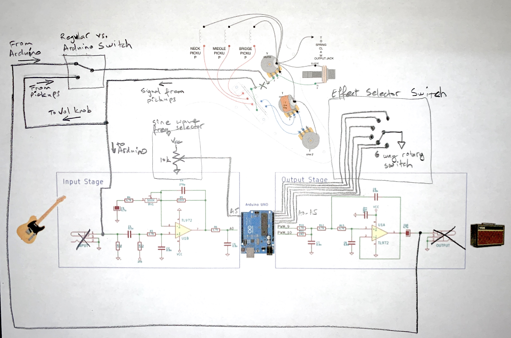

# Electrostrat
#### Arduino UNO based on-board guitar effects processor based on Electrosmash pedal.

Project details can also be found here: https://create.arduino.cc/projecthub/atoorian/electrostrat-1466fa

I built the Electrostrat project to experiment with the idea of having on-board effect built in to a guitar. I had an old strat type guitar laying around, and had been looking at the DIY projects on the Electrosmash website, when I realized that an Arduino UNO fits exactly perfectly into the tremolo spring cavity on the back of most strats. From there, I built a custom shield based on the Electrosmash Pedalshield UNO schematics, and modified my guitar to make room for all the new hardware. I added an effect selector switch, kill switch, on/off switch, and auxiliary knob to the front on the pickguard. I had to do some routing on the guitar body to fit all those parts. The end result is a guitar with 6 built-in effects. Pretty fun!

